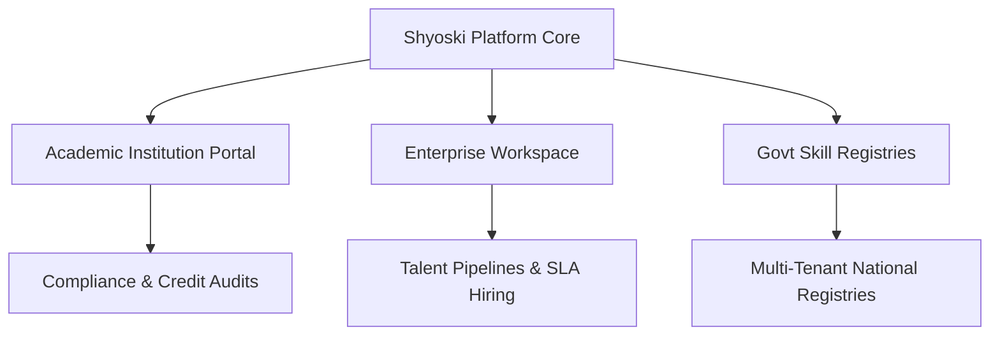
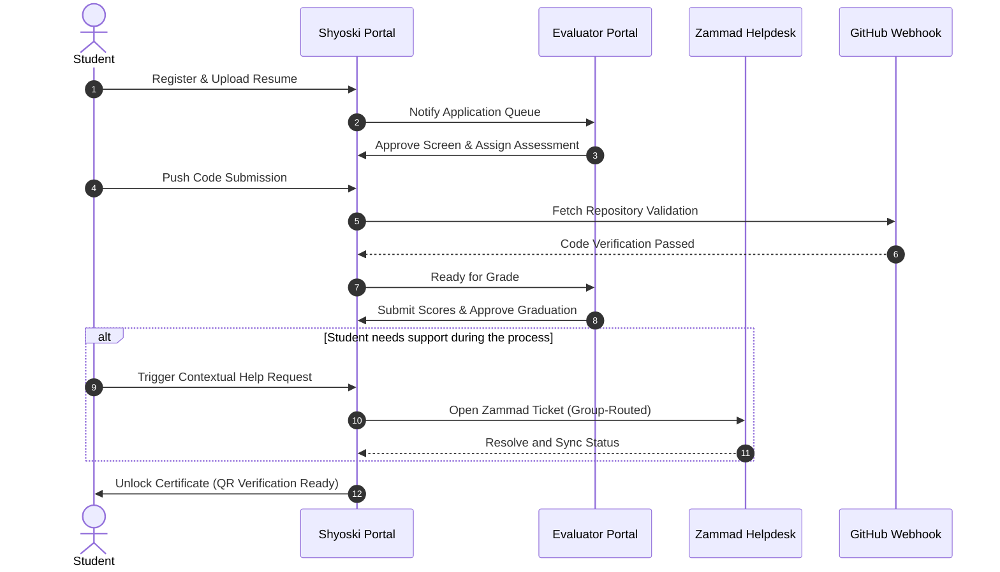
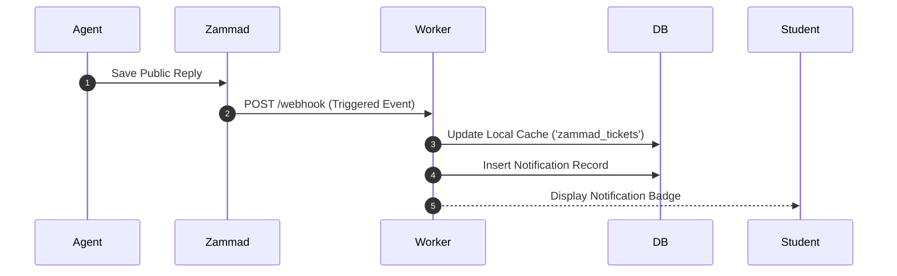
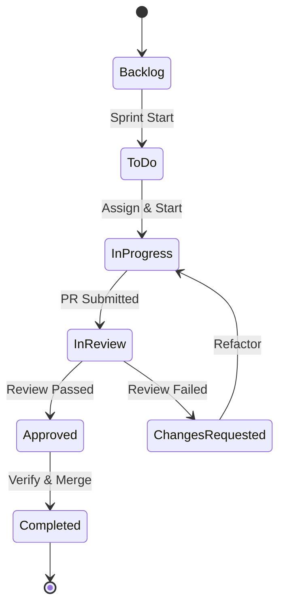
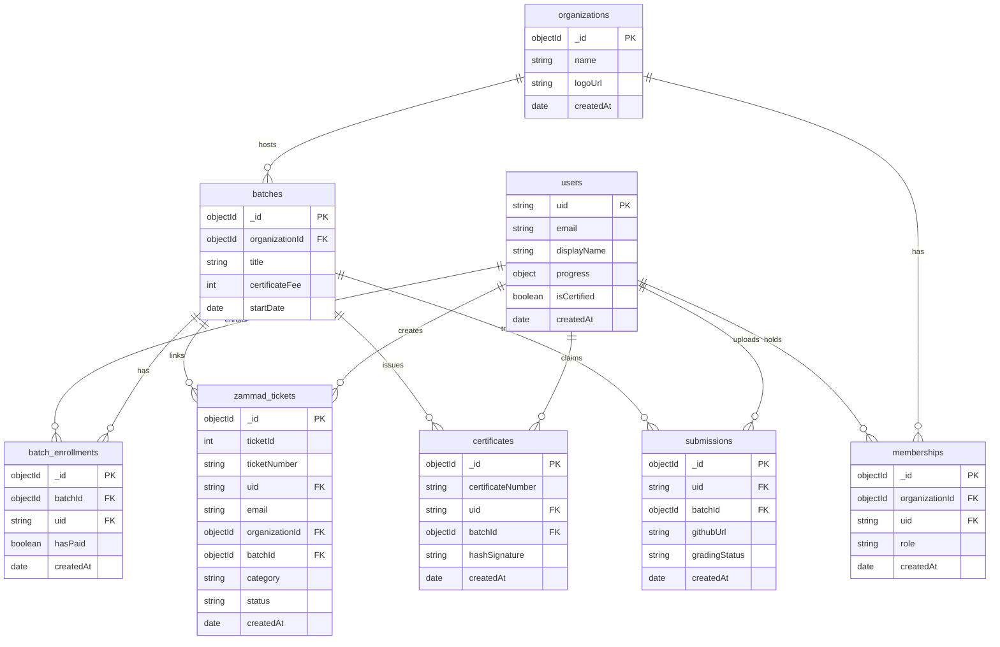
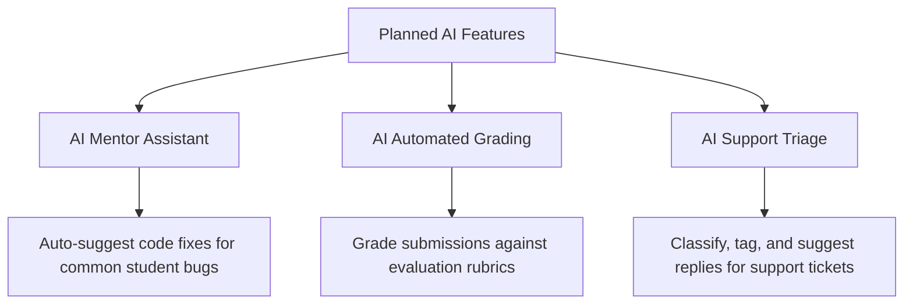

# SHYOSKI ENTERPRISE PLATFORM SPECIFICATION
## Business Proposal, Software Architecture, and System Documentation
### Document Version: 2026.2.0-Enterprise

---

## 1. Executive Summary & Company Profile

### 1.1 Tagline
> **Building Intelligent Internship Ecosystems**

### 1.2 Vision & Mission
*   **Vision:** To build the global backbone of work-integrated learning, turning academic concepts into verified talent capability through spatial and automated collaboration.
*   **Mission:** To empower organizations, universities, and students with a secure, highly scalable, and context-aware platform that structures, evaluates, and validates internship programs.

### 1.3 Company Story & Core Values
Shyoski was founded to bridge the critical gap between academic training and enterprise expectations. Historically, internship programs have been managed using scattered tools—email, spreadsheets, and basic task managers. This ad-hoc approach leads to compliance risks, unverified claims, and high administrative overhead. Shyoski solves this by introducing a unified, multi-tenant workspace where student work is verified, assessed, and recorded transparently.

#### Core Values:
*   **Integrity of Work:** Every talent claim must be backed by verifiable data.
*   **Architectural Simplicity:** We build highly modular, resilient, and event-driven systems.
*   **Operational Transparency:** Secure audit trails protect institutional trust.
*   **Continuous Learning:** Seamless integration of feedback loops speeds up student development.

### 1.4 Long-Term Strategy & Industry Verticals
Shyoski serves three primary industry verticals:
1.  **Universities and Academic Institutions:** Looking to automate compliance tracking, mentor evaluations, and credit scoring.
2.  **Enterprise Organizations:** Aiming to scale recruitments, track project contributions, and automate onboarding.
3.  **Government & Public Sector Programs:** Requiring secure, multi-tenant isolation to run national workforce development and skilling initiatives.



---

## 2. Product Overview

The Shyoski Internship Management Platform is a multi-tenant, cloud-native Software-as-a-Service (SaaS) application designed to govern the entire internship lifecycle. 

```
                                  +-----------------------+
                                  |   Shyoski Gateway     |
                                  |   (Cloudflare/Hono)   |
                                  +-----------+-----------+
                                              |
                     +------------------------+------------------------+
                     |                        |                        |
         +-----------v-----------++-----------v-----------++-----------v-----------+
         |   Student Interface   ||   Enterprise Workspace||  Academic Coordinator |
         |   - Tasks & Backlog   ||   - Project Boards    ||  - Compliance Audits  |
         |   - Need Help Trigger ||   - Evaluation Rubrics||  - Credit Scoring     |
         |   - Payments & Certs  ||   - Support Inbox     ||  - Portal Dashboard   |
         +-----------------------++-----------------------++-----------------------+
```

### 2.1 The Core Problem & Our Solution
Traditional internship management relies on manual tracking, leading to three core issues:
*   **Verification Gaps:** Fake certificate creation and unverified portfolio projects.
*   **Routing Inefficiencies:** Mentors spending time manually distributing tasks and answering basic setup questions.
*   **Compliance Risks:** Lack of structured audit logs to prove students completed their work hours.

Shyoski addresses these issues by securing the workflow with:
*   **Secure API Integrations:** Auto-fetching and validating code submissions directly from GitHub.
*   **QR-Secured Certificates:** Storing cryptographic proof on-chain or in secure Mongo stores.
*   **Decoupled Support Systems:** Routing technical issues, certificate claims, and coursework problems directly to dedicated Zammad ticketing groups.

---

## 3. Product Modules Deep-Dive

Shyoski is structured into independent, logical modules that interact through secure service interfaces:

| Module Name | Targeted User | Primary Function | Data dependencies |
| :--- | :--- | :--- | :--- |
| **Intern Module** | Students | Profile management, project backlogs, and help center access. | `users`, `batch_enrollments` |
| **Company Module** | Org Admins, HR | Workspace custom branding, supervisor allocation, and invoice history. | `organizations` |
| **College Module** | Academic Staff | Syllabus mapping, credit audits, and student performance tracking. | `batches`, `users` |
| **Mentor Module** | Mentors | Task distribution, code reviews, and project evaluations. | `submissions` |
| **Certificate Module**| Students, Admins| Cryptographic token signing, PDF generation, and QR verification. | `certificates` |
| **Ticketing Module** | Support Agents | Routing customer support tickets to Zammad queues. | `zammad_tickets` |
| **Billing Module** | Tenants, Finance | Multi-tenant billing, subscription history, and payment processing. | `payments` |

---

## 4. End-to-End Internship Workflow

This section outlines the candidate lifecycle, from registration and screening to project delivery and graduation.

### 4.1 Lifecycle Sequence Diagram



---

## 5. Zammad Support Integration Architecture

Support queries are managed through an integration with the **Zammad Helpdesk API**, ensuring students receive fast assistance without leaving the Shyoski interface.

```
                    +------------------------------------+
                    |        Student Help Portal         |
                    | (Click "Need Help" -> Post Ticket) |
                    +-----------------+------------------+
                                      |
                                      v
                    +------------------------------------+
                    |       Shyoski Backend Worker       |
                    | - Resolves student context metadata|
                    | - Looks up or creates user in CRM  |
                    | - Posts request to Zammad REST API |
                    +-----------------+------------------+
                                      |
                                      v
                    +------------------------------------+
                    |       Zammad Ticket Router         |
                    | - Categorizes issue (SLA assigned) |
                    | - Routes to Agent Group Queue      |
                    +------------------------------------+
```

### 5.1 Dynamic User Mapping & Routing
When a student submits a ticket, the backend executes `resolveOrCreateCustomer` using the admin credentials to:
1. Search Zammad for a customer with email matching the student.
2. Create a new customer profile in Zammad if they don't exist.
3. Submit the support ticket using the resolved numeric `customer_id`.

```javascript
// Dynamic user lookup & registration in TicketService
static async getOrCreateCustomer(env, actor) {
  const email = actor.email;
  try {
    const search = await ZammadClient.request(env, `/users/search?query=email:${encodeURIComponent(email)}&limit=1`);
    if (search && search.length > 0) return search[0].id;
  } catch (e) {
    console.warn("Zammad customer lookup warning:", e.message);
  }
  const displayName = actor.displayName || email.split("@")[0];
  const parts = displayName.trim().split(/\s+/);
  const firstname = parts[0] || "Student";
  const lastname = parts.slice(1).join(" ") || "User";
  
  const result = await ZammadClient.request(env, "/users", {
    method: "POST",
    body: JSON.stringify({ firstname, lastname, email, roles: ["Customer"] })
  });
  return result.id;
}
```

### 5.2 Structured Context Injection
To provide agents with complete context, the backend automatically attaches metadata to the ticket description:

```
---
Shyoski Context
Student UID: P2nn5JBDR4W3KxApccXzAqh3Vbv1
Organization: Wile E. Coyote Internships
Batch: Frontend Specialist
Assignment: Dashboard View (Week 4)
Submission: https://github.com/Manjunath2133/shysoki/pull/22
GitHub: https://github.com/Manjunath2133/shysoki
Category: Task Issue
Attempt Number: 1
---
Problem:
Unable to fetch assignments list.
```

### 5.3 Categorization & Escalation Matrix
Tickets are categorized and routed to specific support groups in Zammad, each governed by Service Level Agreements (SLAs):

| Support Category | Severity | Target Group | Response SLA | Resolution SLA |
| :--- | :--- | :--- | :--- | :--- |
| **Technical Issue** | Critical | Technical Team | 2 Hours | 8 Hours |
| **Task Issue** | High | Mentor Support | 4 Hours | 12 Hours |
| **Evaluation Issue** | High | Evaluator Support| 4 Hours | 24 Hours |
| **Certificate Issue**| Medium | Certificate Team | 8 Hours | 48 Hours |
| **General Question** | Low | General Support | 24 Hours | 72 Hours |

### 5.4 Webhook Notification Loop
When an agent replies to a ticket in Zammad, a webhook triggers `POST /api/v2/support/webhook` on our Cloudflare Workers. This updates the local database cache and sends an in-app notification to the student's dashboard.



---

## 6. SCRUM & Agile Management

The platform includes a SCRUM dashboard to help interns learn industry-standard agile workflows.

```
       +------------------+
       |   Product Backlog|
       |  (Task Library)  |
       +--------+---------+
                |
                v
       +------------------+      Sprints (1-4 Weeks)
       |   Sprint Backlog | ------------------------+
       |   (Weekly Goals) |                         |
       +--------+---------+                         v
                |                             +-----------+
                |                             |  Kanban   |
                +---------------------------->|  Board    |
                                              +-----------+
```

### 6.1 SCRUM Hierarchy & Rules
*   **Epic:** High-level deliverables (e.g., *Database Integration*).
*   **User Story:** Customer-centric requirements (e.g., *As a user, I want to authenticate via Google*).
*   **Task:** Technical implementation items mapped to story points.
*   **Subtask:** Granular steps assigned to interns (maximum of 4 story points per subtask).

### 6.2 Story Point Allocations
Story point allocations use a modified Fibonacci sequence to determine task complexity:
*   **1 SP:** Simple text updates, documentation, or minor CSS styling.
*   **2 SP:** Form inputs validation, API endpoint consumption, or writing basic unit tests.
*   **3 SP:** CRUD operations, creating database models, or complex UI components.
*   **5 SP:** Multi-service integrations, payment gateways, or cache layers setup.
*   **8 SP:** Complex database migrations or performance optimization issues.

---

## 7. Task Management Lifecycle

Interns manage their assignments through a structured task lifecycle that ensures code quality and mentor review:



### 7.1 Automated Submission Checks
Submissions are evaluated through automated verification rules:
*   **Pull Request Verification:** Checks if a pull request exists on the student's linked repository.
*   **Commit Message Check:** Verifies commits follow Conventional Commits guidelines (e.g., `feat:`, `fix:`).
*   **Automated Tests:** Triggers pipeline runs and captures test results.

---

## 8. Security Architecture

The platform is designed around a multi-layered security model to protect user data and ensure compliance.

```
   [ Client Browser ]
           |
           v (HTTPS/WAF)
     [ Cloudflare ]  ---> Rate Limiting, DDoS Shield, WAF Rule Shield
           |
           v (Authorization Header Bearer Token)
   [ Hono Gateway ]  ---> JWT Signature Check, Auth Context Resolution
           |
           v
     [ RBAC Rules ]  ---> Role Authorization Validation
           |
           v
    [ MongoDB DB ]   ---> Tenant-Isolated Storage
```

### 8.1 Authentication & JWT Verification
The application uses Firebase Authentication for user accounts, combined with verified JSON Web Tokens (JWT) for API request authorization:

```javascript
// Middleware validation in src/middleware/auth.js
export const RequireAuth = async (c, next) => {
  const authHeader = c.req.header("Authorization");
  if (!authHeader || !authHeader.startsWith("Bearer ")) {
    return c.json({ error: "Unauthorized: Missing auth credentials" }, 401);
  }
  const token = authHeader.substring(7);
  try {
    const userPayload = await verifyFirebaseToken(token, c.env.FIREBASE_PROJECT_ID);
    c.set("user", userPayload);
    await next();
  } catch (err) {
    return c.json({ error: "Unauthorized: Invalid auth signature" }, 401);
  }
};
```

### 8.2 Role-Based & Attribute-Based Access Control (RBAC/ABAC)
The permission model uses Roles (e.g., *Student, Mentor, OrgAdmin, SuperAdmin*) combined with attribute checks (such as *Membership Status* and *Organization ID*) to authorize actions:

```javascript
// Role checking middleware
export const RequireTenantRole = (allowedRoles) => {
  return async (c, next) => {
    const user = c.get("user");
    if (!user || !allowedRoles.includes(user.role)) {
      return c.json({ error: "Forbidden: Insufficient permissions" }, 403);
    }
    await next();
  };
};
```

### 8.3 Security Hardening Configurations
To protect the API and underlying infrastructure, the following security measures are implemented:
*   **CORS Policies:** Configured with strict domain whitelist restrictions.
*   **Security Headers:** Implements HTTP Strict Transport Security (HSTS), Content Security Policy (CSP), and anti-clickjacking headers (`X-Frame-Options: DENY`).
*   **API Rate Limiting:** Enforces limit thresholds per IP address (100 requests per minute) to protect against brute-force attacks.
*   **SQL/NoSQL Injection Shield:** Input data is validated using strict Zod schema schemas.

---

## 9. Multi-Tenant Architecture

Shyoski uses a **Logical Database Isolation** model. Multiple organizations share the same MongoDB cluster, but data access is isolated at the query level using an `organizationId` filter.

```
                  +--------------------------------+
                  |         Hono Gateway           |
                  +---------------+----------------+
                                  |
                                  | Resolve organization context
                                  v
                  +---------------+----------------+
                  |  ResolveOrganization Middleware |
                  +---------------+----------------+
                                  |
            Inject orgId context  v
     +----------------------------+----------------------------+
     |                                                         |
     v                                                         v
+----+---------------------------+                        +----+---------------------------+
|    Organization A Context      |                        |    Organization B Context      |
|                                |                        |                                |
| Query:                         |                        | Query:                         |
| {                              |                        | {                              |
|   orgId: "6a34735c5c8d60...",  |                        |   orgId: "6b772288cd2255...",  |
|   ...                          |                        |   ...                          |
| }                              |                        | }                              |
+--------------------------------+                        +--------------------------------+
```

### 9.1 Tenant Resolution Middleware
Every request directed to organization-specific resources must pass through the `ResolveOrganization` middleware, which validates tenant membership and injects the resolved context:

```javascript
export const ResolveOrganization = async (c, next) => {
  const orgId = c.req.param("orgId");
  const user = c.get("user");
  
  if (!ObjectId.isValid(orgId)) {
    return c.json({ error: "Bad Request: Invalid Organization ID format" }, 400);
  }
  
  // Verify that the user belongs to this organization
  const membership = await db.collection("memberships").findOne({
    organizationId: new ObjectId(orgId),
    uid: user.uid
  });
  
  if (!membership) {
    return c.json({ error: "Forbidden: Not an active member of this tenant" }, 403);
  }
  
  c.set("organizationId", new ObjectId(orgId));
  c.set("tenantRole", membership.role);
  await next();
};
```

---

## 10. System Architecture & Tech Stack

Shyoski's tech stack is designed for low latency, high availability, and horizontal scalability.

```
[ Client Web App (React / Vite) ]
               |
               v (Cloudflare DNS Router)
[ Edge CDN / Cloudflare Gateway WAF ]
               |
               v (HTTPS Proxy)
[ Node.js Dev Server / wrangler host ]
               |
               +---> [ Hono Application Router (src/index.js) ]
                           |
                           +---> [ Redis Cache Layer ]
                           |
                           +---> [ MongoDB Database (shyoski_v2) ]
                           |
                           +---> [ Zammad Tickets API ]
```

### 10.1 Key Technologies
*   **Frontend Framework:** React 19, Vite, TailwindCSS (v4), framer-motion (for micro-animations), and Lucide React.
*   **Backend Server:** Hono routing framework deployed on Cloudflare Workers (using wrangler local emulation for development).
*   **Database:** MongoDB running on a global Atlas replica set cluster.
*   **Cache:** Redis Cluster for session state management and API query caching.
*   **Integrations:** Zammad API client wrapper for support ticket management.

---

## 11. Database Schema Design

The following Entity-Relationship Diagram outlines the core database collections and their associations.

### 11.1 Entity-Relationship Diagram (ERD)



### 11.2 Database Indexing Strategies
To optimize query performance, we maintain the following indexes:
*   `zammad_tickets`: `{ uid: 1, ticketId: 1 }` (optimizes user ticket lookups and webhook updates).
*   `batch_enrollments`: `{ batchId: 1, uid: 1 }` (ensures uniqueness and speeds up enrollment checks).
*   `memberships`: `{ organizationId: 1, uid: 1 }` (resolves tenant verification requests).

---

## 12. API Documentation

Our API follows RESTful conventions, returning JSON payloads and standard HTTP status codes.

### 12.1 Authentication & Headers
All requests to protected routes must include the authorization header:
`Authorization: Bearer <firebase_id_token>`

### 12.2 Standard Error Codes
*   `400 Bad Request`: Missing body attributes or invalid formatting.
*   `401 Unauthorized`: Invalid or expired JWT authentication signature.
*   `403 Forbidden`: Authenticated user lacks access to the resource.
*   `404 Not Found`: Target resource or endpoint does not exist.
*   `429 Too Many Requests`: Rate limiting threshold exceeded.
*   `500 Internal Server Error`: Unhandled server exception.

### 12.3 Core Endpoints

#### `POST /api/v2/organizations/:orgId/support/tickets`
Creates a ticket in Zammad and saves a mapping record to MongoDB.
*   **Request:**
    ```json
    {
      "title": "Cannot Claim Certificate",
      "category": "Certificate Issue",
      "body": "Payment completed but certificate is still locked.",
      "batchId": "6a40bace316f2047411daf54"
    }
    ```
*   **Response (`201 Created`):**
    ```json
    {
      "success": true,
      "ticket": {
        "id": 142,
        "number": "73142",
        "title": "[Certificate Issue] Cannot Claim Certificate",
        "state": "new"
      }
    }
    ```

#### `GET /api/v2/organizations/:orgId/support/tickets`
Lists all support tickets raised by the authenticated student.
*   **Response (`200 OK`):**
    ```json
    [
      {
        "id": 142,
        "number": "73142",
        "title": "[Certificate Issue] Cannot Claim Certificate",
        "category": "Certificate Issue",
        "stateName": "new",
        "createdAt": "2026-06-29T10:52:19.933Z",
        "updatedAt": "2026-06-29T10:52:19.933Z"
      }
    ]
    ```

#### `GET /api/v2/organizations/:orgId/support/tickets/:ticketId/articles`
Returns all public replies and notes for a specific support ticket.
*   **Response (`200 OK`):**
    ```json
    [
      {
        "id": 1,
        "body": "Your ticket has been received. Our team is investigating.",
        "contentType": "text/html",
        "createdBy": 2,
        "createdAt": "2026-06-29T10:52:20.101Z",
        "isCustomer": false,
        "sender": "Agent"
      }
    ]
    ```

---

## 13. Performance & Scaling Matrix

Our scaling model uses vertical and horizontal growth tiers to maintain performance as user counts increase:

| Active Concurrent Users | Target Response Time | Database Target | Cache Layer | Auto Scaling Strategy |
| :--- | :--- | :--- | :--- | :--- |
| **10 - 100** | < 100ms | Single DB Node | Not Required | Fixed Node Count |
| **500 - 1,000** | < 150ms | Primary + 1 Replica | Redis Standalone | CPU-based Scaling (50% threshold) |
| **5,000 - 10,000** | < 200ms | Primary + 2 Replicas | Redis Primary-Replica | CPU-based Scaling (65% threshold) |
| **50,000+** | < 250ms | Sharded Mongo Cluster | Redis Cluster (Sharded) | Event-based scaling (pre-warmed scaling) |

```
                               +-------------------------+
                               | Cloudflare Load Balancer|
                               +------------+------------+
                                            |
                    +-----------------------+-----------------------+
                    |                                               |
                    v                                               v
        +-----------+-----------+                       +-----------+-----------+
        |  Backend Worker App 1 |                       |  Backend Worker App 2 |
        +-----------+-----------+                       +-----------+-----------+
                    |                                               |
                    +-----------------------+-----------------------+
                                            |
                                            v
                               +------------+------------+
                               |      Redis Cache        |
                               +------------+------------+
                                            |
                                            v
                               +------------+------------+
                               |     MongoDB Cluster     |
                               | (Replica Set / Shards)  |
                               +-------------------------+
```

### 13.1 Key Scaling Strategies
*   **Horizontal Autoscaling:** Automatically spins up new application instances when average CPU usage exceeds 65% for more than 3 minutes.
*   **Database Query Optimization:** Database indexes are regularly updated, and heavy read queries are directed to replica sets to reduce load on the primary node.
*   **Session and Query Caching:** Uses Redis to store active session states and cache recurring API queries.
*   **Content Delivery Network (CDN):** Cloudflare edges cache static frontend assets, reducing network latency for global users.

---

## 14. DevOps & CI/CD Pipelines

Our continuous integration and deployment pipeline automates validation, building, testing, and deployment.

### 14.1 Continuous Integration Pipeline Workflow

```
[ Git Push / PR ]
       |
       v
[ Lint Validation ] ---> Check style guidelines
       |
       v
[ Security Scanning ] ---> Run vulnerability checks
       |
       v
[ Run Unit Tests ] ---> Validate code correctness
       |
       v
[ Build Production Bundle ] ---> Compile assets (React/Vite)
       |
       v
[ Deploy to Staging ] ---> Push to verification environment
```

---

## 15. Client Onboarding & Implementation Plan

We follow an 8-stage onboarding process to ensure smooth transition and setup for new clients:

```
+---------------+      +---------------+      +---------------+      +---------------+
| 1. Discovery  | ---> | 2. Design     | ---> | 3. Provision  | ---> | 4. Migration  |
+---------------+      +---------------+      +---------------+      +---------------+
                                                                             |
+---------------+      +---------------+      +---------------+              |
| 8. Support    | <--- | 7. Go-Live    | <--- | 6. Training   | <--- --------+
+---------------+      +---------------+      +---------------+
```

1.  **Discovery (Week 1):** Detail technical scope, identify user directories, and define reporting requirements.
2.  **Design (Week 2):** Define domain configurations, customize corporate branding settings, and map organization roles.
3.  **Provisioning (Week 3):** Set up isolated database collections, configure SSO integration, and provision Zammad support groups.
4.  **Migration (Week 4):** Import historical student portfolios and active batch lists.
5.  **Integration Testing (Week 5):** Verify API endpoints, test payment gateway configurations, and validate Zammad webhook loops.
6.  **Training (Week 6):** Conduct administrator dashboard training and mentor alignment workshops.
7.  **Go-Live (Week 7):** Deploy platform live and configure production DNS configurations.
8.  **Support Handover (Week 8+):** Hand over system operations to our support engineers under active SLA contracts.

---

## 16. Customer Support, SLA & Incident Recovery

### 16.1 Target Availability SLAs
We offer three tiers of support and availability SLAs designed for different organizational scales:

```
                                  +-----------------------+
                                  |     Support Tiers     |
                                  +-----------+-----------+
                                              |
                     +------------------------+------------------------+
                     |                        |                        |
         +-----------v-----------++-----------v-----------++-----------v-----------+
         |      Gold Tier        ||     Silver Tier      ||   Enterprise Tier    |
         |  - 99.5% Uptime       ||  - 99.9% Uptime      ||  - 99.99% Uptime     |
         |  - Business Hours     ||  - 24/7 Priority     ||  - 24/7 Dedicated    |
         |  - Next-Day Resol.    ||  - 4-Hour Response   ||  - 1-Hour Response   |
         +-----------------------++-----------------------++-----------------------+
```

### 16.2 Disaster Recovery RTO & RPO Tiers

```
+--------------------+--------------------------------+--------------------------------+
| SLA Tier           | Recovery Time Objective (RTO)  | Recovery Point Objective (RPO) |
+--------------------+--------------------------------+--------------------------------+
| **Gold**           | 12 Hours                       | 24 Hours                       |
| **Silver**         | 4 Hours                        | 4 Hours                        |
| **Enterprise**     | 1 Hour                         | 1 Hour                         |
+--------------------+--------------------------------+--------------------------------+
```

---

## 17. AI Capabilities Roadmap

Our product roadmap includes several planned AI features to improve the platform's automation capabilities:



---

## 18. Platform Comparison Matrix

Comparing Shyoski's integrated approach against traditional methods:

| Feature Area | Shyoski Platform | Excel & Email Workflows | Generic HR Software | Traditional LMS |
| :--- | :--- | :--- | :--- | :--- |
| **Authentication** | Unified Firebase + SSO | None | Username / Password | LMS Credentials |
| **Verification** | Cryptographic QR Codes | Manual Signature | None | Simple PDF export |
| **Support System** | Direct Zammad Integration| Shared Inbox | IT Helpdesk | Course Q&A Forums |
| **Security Auditing**| Immutable Audit Logs | Manual Revision History | basic access logs | None |
| **Scaling Capability**| Auto-scaling Workers | Hard Size Constraints | High License Costs | High Server Overhead |

---

## 19. Pricing & Deployment Models

We offer flexible subscription plans and deployment models to fit different organizational sizes and security requirements:

```
                                +---------------------------+
                                |  Pricing & Deployments    |
                                +-------------+-------------+
                                              |
                      +-----------------------+-----------------------+
                      |                                               |
                      v                                               v
        +-------------+-------------+                   +-------------+-------------+
        |       Pricing Tiers       |                   |     Deployment Models     |
        +-------------+-------------+                   +-------------+-------------+
                      |                                               |
         +------------+------------+                     +------------+------------+
         | - Standard SaaS         |                     | - Multi-Tenant Cloud    |
         | - Institutional         |                     | - Private Cloud (AWS/GC)|
         | - Custom Enterprise     |                     | - On-Premise Sandbox    |
         +-------------------------+                     +-------------------------+
```

---

## 20. Appendix

### 20.1 Glossary of Terms
*   **Tenant:** An isolated organization profile workspace (such as a university or company) running on the shared Shyoski platform.
*   **Wrangler:** The Cloudflare command-line tool used to run, build, and deploy Hono Worker APIs locally and in production.
*   **Article:** A conversation message, response, or internal note posted inside a support ticket.
*   **Story Points (SP):** A numerical unit representing the complexity, risk, and effort required to resolve a task.

---
*End of Specification.*
