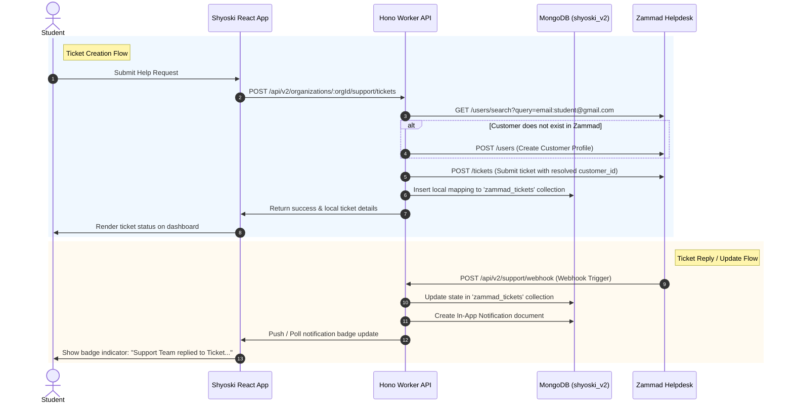

# Shyoski & Zammad Ticketing Integration Guide

This guide details the architecture, request flows, data mappings, environment configurations, and setup instructions for the **Zammad Support Ticketing Integration** within the Shyoski ecosystem.

---

## 1. Integration Design Goals

*   **Seamless Student Experience:** Students interact solely with the Shyoski frontend. They do not log into Zammad directly or see the Zammad UI.
*   **Centralized Agent Dashboard:** Mentors, Evaluators, and Admins handle, assign, and reply to support tickets directly inside the Zammad Helpdesk.
*   **Modular Architecture:** The Shyoski backend acts as the gateway/integration layer, ensuring the Zammad integration can be modified or replaced in the future without impacting core business code.
*   **Single Source of Truth:** MongoDB remains the source of truth for all internship and batch progress data. Zammad is used exclusively to store support conversation threads, ticket states, and internal support collaboration.

---

## 2. System Architecture

The following diagram illustrates how the student dashboard, backend worker services, MongoDB, and Zammad interact:



---

## 3. Data Mappings & Database Schema

We maintain a lightweight collection in MongoDB named `zammad_tickets` to map internal Shyoski user contexts to external Zammad tickets.

### `zammad_tickets` Schema:
```json
{
  "_id": "ObjectId",
  "ticketId": 2,                       // Numeric ID returned by Zammad
  "ticketNumber": "73002",             // Customer-facing ticket identifier
  "uid": "P2nn5JBDR4W3KxApccXzAqh3Vbv1", // Student's Firebase Auth ID
  "email": "student2@gmail.com",       // Student's email
  "organizationId": "ObjectId",        // Associated Organization ID
  "batchId": "ObjectId",               // Student's Batch ID (optional)
  "category": "Certificate Issue",     // Support Category
  "status": "new",                     // Live Zammad ticket status (new, open, closed, etc.)
  "createdAt": "ISODate",
  "updatedAt": "ISODate"
}
```

---

## 4. API Endpoints

The Shyoski backend Hono router maps support requests to `TicketService`:

### A. Create Ticket
*   **Route:** `POST /api/v2/organizations/:orgId/support/tickets`
*   **Payload:**
    ```json
    {
      "title": "Help with Certificate Generation",
      "category": "Certificate Issue",
      "body": "I am unable to claim my completion certificate...",
      "batchId": "6a40bace316f...",
      "assignmentId": "6a...",
      "submissionId": "6a..."
    }
    ```
*   **Process:**
    1. Looks up student organization and batch meta-context from MongoDB.
    2. Runs `resolveOrCreateCustomer`:
        - Searches Zammad for a customer with email matching the student.
        - Creates a new Zammad customer profile if they don't exist.
    3. Formats a structured **Shyoski Context Header** (UID, Batch, Assignment details, GitHub URL, etc.) and prepends it to the ticket description for support agents.
    4. Routes the ticket to the correct Zammad Queue Group based on the chosen category.
    5. Saves the ticket map to MongoDB's `zammad_tickets`.

### B. List Tickets
*   **Route:** `GET /api/v2/organizations/:orgId/support/tickets`
*   **Process:**
    1. Fetches all ticket mappings for the current student's `uid` from MongoDB.
    2. Calls Zammad `/tickets/search?query=customer.email:email` using the admin credentials.
    3. Merges the Zammad response payload with local DB ticket records. 
    4. **Elastisearch Index Latency Bypass:** If Zammad has not yet indexed a newly created ticket, it falls back to displaying cached database information. This keeps the user interface responsive.

### C. Get Ticket Conversation (Articles)
*   **Route:** `GET /api/v2/organizations/:orgId/support/tickets/:ticketId/articles`
*   **Process:**
    1. Verifies that the requesting student owns the `ticketId` (preventing ID enumeration).
    2. Requests ticket details from Zammad to fetch the `customer_id`.
    3. Retrieves all public conversation articles (`GET /ticket_articles`).
    4. Evaluates `isCustomer: article.created_by_id === customerId` for each article. The frontend uses this boolean to render the student's messages on the right (as "You") and agent messages on the left (as "Support Team").

### D. Reply to Ticket
*   **Route:** `POST /api/v2/organizations/:orgId/support/tickets/:ticketId/reply`
*   **Payload:** `{ "body": "Thank you, that worked!" }`
*   **Process:** Creates a new article in the Zammad ticket on behalf of the customer.

---

## 5. Environment Variables Configuration

In `.dev.vars` (for local development) or Cloudflare Worker Dashboard (for production), set the following:

```ini
# Zammad server endpoint
ZAMMAD_URL=http://localhost:8080

# API access token generated from Zammad Profile Settings
ZAMMAD_API_TOKEN=ss5yXnejCkBfvdopUvo0X2ps4J7If-STYYhKZZGIw4LHPFW_1UVDi92J63R2GHHi

# Default fallback routing group in Zammad
ZAMMAD_DEFAULT_GROUP=Users

# Webhook secret signature validation (optional, recommended for production)
ZAMMAD_WEBHOOK_SECRET=abc123yoursecret
```

---

## 6. Zammad Configuration Steps

To ensure smooth operations, complete the following configuration steps within your Zammad administrator dashboard (http://localhost:8080):

### Step 1: Assign Agent Permissions to Groups
Zammad will return `403 Forbidden` if the API agent does not have access permissions assigned to the support groups.
1. Go to **Admin (Gear icon)** -> **Manage** -> **Users**.
2. Select your Admin/Agent user account (the owner of the API token).
3. Scroll down to the **Groups** panel.
4. Verify that you have checked the **`read`**, **`write`**, and **`create`** checkboxes for **all** target groups (*Users, Technical Team, Mentor Support, Evaluator Support, Certificate Team, General Support*).
5. Click **Update**.

### Step 2: Configure Webhook Synchronization
To trigger instant in-app alerts when agents reply:
1. Go to **Admin** -> **Webhooks**.
2. Click **Add Webhook**:
    *   **Name:** `Shyoski Notification Trigger`
    *   **Endpoint URL:** `http://localhost:8787/api/v2/support/webhook`
    *   **HTTP Method:** `POST`
    *   **Content Type:** `application/json`
    *   **Event triggers:** Select `ticket.updated` and `article.created`.
3. Click **Save** and verify the status is set to **Active**.
